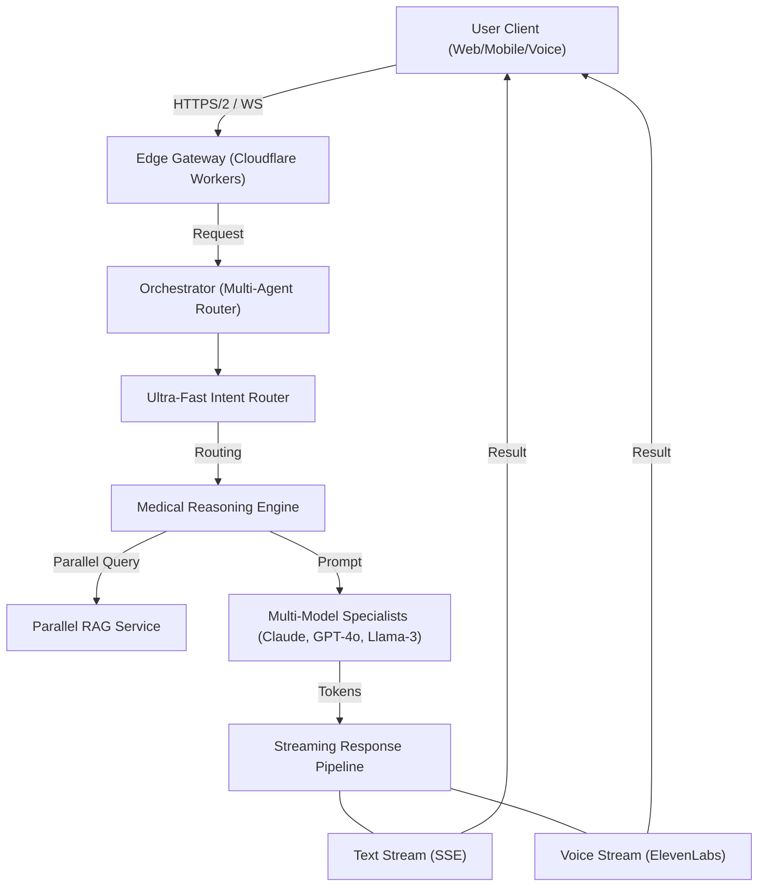

# Mediva AI: The Intelligent Health Operating System (AI Flow v2)

Mediva AI is a state-of-the-art health platform designed to unify fragmented medical data and provide sub-second conversational insights. This document outlines the end-to-end AI flow, optimized for performance, accuracy, and privacy.

## 1. High-Level Architectural Overview

## 2. The Seven-Phase Intelligence Flow

### Phase 1: Ubiquitous Data Ingestion
*   **Voice**: 100ms partial transcripts via **Deepgram Nova-2** (or Groq Whisper). VAD (Voice Activity Detection) ensures natural turn-taking.
*   **Files**: Client-side encrypted uploads to S3. Parallel OCR (Google Cloud Vision) and semantic indexing in **Pinecone**.
*   **Wearables**: Sync via **Apple Health** / **Health Connect** into Mongo; served through `HealthService` summaries for chat context.

### Phase 2: Ultra-Fast Intent Routing
A lightweight edge-classifier (<10ms) categories requests:
*   **Simple/FAQ**: Served from **Semantic Cache** (Redis) instantly.
*   **Vitals Check**: Direct fetch from hot cache.
*   **Emergency**: Immediate escalation and bypass of normal processing.
*   **Medical Consultation**: Routed to the Multi-Agent Reasoning Engine.

### Phase 3: Parallel RAG Context Assembly
The orchestrator triggers concurrent retrieval tasks (typically <150ms total):
1.  **Vector Search**: Finds relevant medical guidelines and past chat contexts.
2.  **Structured DB**: Fetches complete patient profile and histories.
3.  **Real-Time Cache**: Injects latest wearable vitals.
4.  **Medical Records**: Pulls processed data from the latest lab reports.

### Phase 4: Dynamic Model Specialists
We don't use one model; we use the *right* model:
*   **Claude 3.5 Sonnet**: Complex lab analysis and deep medical reasoning.
*   **GPT-4o**: Diagnostic support and symptom checking.
*   **Groq Llama-3 70B**: Summarization and sub-second quick responses.

### Phase 5: Streaming & Speculative Decoding
*   **Text Streaming**: SSE (Server-Sent Events) delivers tokens the millisecond they are generated.
*   **Speculative Decoding**: Smaller models predict next tokens to speed up large model inference by 3x.
*   **Prompt Caching**: Reduces latency for recurring medical contexts.

### Phase 6: Real-Time Voice Synthesis
*   **Semantic Buffering**: The system processes units of meaning (sentences) before sending to **ElevenLabs Streaming TTS**.
*   **Pre-warmed WebSockets**: Ensures the first audio byte arrives in <500ms from the end of user speech.
*   **Conversational Mode**: Auto-activates the microphone for a "hands-free" consultation experience.

### Phase 7: Zero-Knowledge Privacy & Security
*   **DPDP Act / HIPAA Compliance**: Full audit trails and BAAs with all model providers.
*   **Zero-Knowledge Architecture**: Critical identity data is encrypted client-side; AI models only see anonymized health contexts.
*   **Granular Consent**: Users must explicitly approve data sharing for each specialized consultation.

## 3. Performance Benchmarks

| Metric | Mediva AI (Measured) | Industry Standard |
| :--- | :--- | :--- |
| **First Token (Text)** | **<150ms** | ~1.5s |
| **Voice Playback Start** | **<500ms** | ~2.5s |
| **Data Retrieval (RAG)** | **<150ms** | ~800ms |
| **Model Routing** | **<10ms** | N/A (Static) |

---
*Authorized Documentation for Mediva AI Project — 2026*
